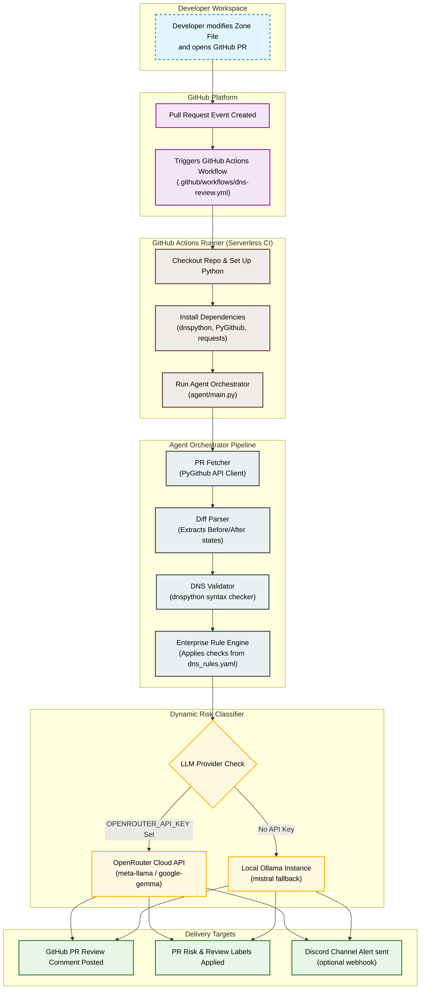

# IM-08 — DNS Zone File Reviewer (GitHub PR Bot)
### AI-Powered DNS Change Review Agent | Hackathon Round 4

---

## Table of Contents
1. [What Is This Project?](#what-is-this-project)
2. [Real-World Problem It Solves](#real-world-problem-it-solves)
3. [How It Works — End to End](#how-it-works--end-to-end)
4. [Full Tech Stack](#full-tech-stack)
5. [Architecture Diagram](#architecture-diagram)
6. [Project Folder Structure](#project-folder-structure)
7. [Each Stack Explained](#each-stack-explained)
8. [Setup & Installation](#setup--installation)
9. [How to Run & Demo](#how-to-run--demo)
10. [Sample Output](#sample-output)
11. [AI Capabilities Used](#ai-capabilities-used)
12. [Open Source & Free Tools Used](#open-source--free-tools-used)

---

## What Is This Project?

**IM-08 DNS Zone File Reviewer** is an AI agent that automatically reviews
DNS zone file changes in GitHub Pull Requests.

When a developer modifies a DNS zone file and opens a PR, this agent:
- Reads the diff (what changed)
- Validates DNS syntax using `dnspython`
- Uses a cloud LLM (OpenRouter) or local LLM (Ollama/Mistral) to classify risk level
- Applies rule-based checks (wildcards, low TTL, MX changes)
- Posts a structured review comment directly on the GitHub PR

> **One-liner:** "We built an AI agent that automatically reviews DNS changes
> in GitHub PRs before they cause production outages — zero human intervention,
> under 60 seconds (using OpenRouter Cloud or local Ollama)."

---

## Real-World Problem It Solves

DNS misconfigurations are one of the most common causes of production outages:

| Real Incident          | Cause                        | Impact                    |
|------------------------|------------------------------|---------------------------|
| Facebook Oct 2021      | DNS BGP misconfiguration     | 6-hour global outage      |
| Cloudflare Jul 2020    | BGP + DNS route leak         | Millions of users affected |
| GitLab 2017            | Accidental DNS record delete | 18-hour downtime           |
| Slack 2021             | DNS TTL misconfiguration     | Service degradation        |

**Without this tool:**
- DNS changes are reviewed manually (slow, error-prone)
- Engineers miss risky patterns (wildcards, low TTL, wrong MX)
- A bad change can go live before anyone notices

**With this tool:**
- Every DNS PR gets auto-reviewed in < 60 seconds
- AI flags risky changes with explanations
- Team is notified instantly via PR comment
- No infra needed — runs serverlessly in GitHub Actions

---

## How It Works — End to End

```
STEP 1: Developer opens a GitHub PR
        └─ Modifies zones/example.com.txt

STEP 2: GitHub Actions workflow fires automatically
        └─ Triggered by: on pull_request  paths: ['zones/**']

STEP 3: Agent fetches PR diff via GitHub API
        └─ Extracts: before content vs after content of zone file

STEP 4: dnspython validates DNS syntax
        └─ Checks: A, CNAME, MX, TXT, NS record syntax
        └─ Flags: malformed records, missing TTLs, bad IP formats

STEP 5: Change Diff Parser identifies what changed
        └─ Added records (new lines)
        └─ Removed records (deleted lines)
        └─ Modified records (changed lines)

STEP 6: Rule Engine applies risk rules
        └─ Rule 1: Wildcard records (*.domain.com)  HIGH RISK
        └─ Rule 2: TTL < 300 seconds  MEDIUM RISK
        └─ Rule 3: MX record changes  HIGH RISK
        └─ Rule 4: SOA serial not updated  WARNING
        └─ Rule 5: NS record changes  CRITICAL RISK

STEP 7: LLM (OpenRouter Gemma 4 Free OR Ollama Mistral 7B) analyzes each change
        └─ Prompt: "Analyze this DNS change and classify risk"
        └─ Returns: Safe / Warning / High Risk / Critical
        └─ With: plain-English explanation of why and mitigation suggestions

STEP 8: Agent Orchestrator combines all outputs
        └─ Merges: syntax errors + rule flags + LLM analysis
        └─ Formats: structured markdown review comment

STEP 9: GitHub PR Bot posts the review comment
        └─ Uses: PyGithub to call GitHub API
        └─ Posts: Review comment on the PR with full analysis
        └─ Labels: PR as 'dns-reviewed' + risk level tag

DONE: Developer sees AI review comment on their PR instantly!
```

---

## Full Tech Stack

| Layer              | Tool/Library        | Version   | License    | Cost  |
|--------------------|---------------------|-----------|------------|-------|
| CI/CD Trigger      | GitHub Actions      | Latest    | Free (OSS) | FREE  |
| Language           | Python              | 3.10+     | PSF        | FREE  |
| DNS Validation     | dnspython           | 2.4.2     | ISC        | FREE  |
| GitHub API         | PyGithub            | 2.1.1     | LGPL       | FREE  |
| Cloud AI/LLM       | OpenRouter          | Latest    | Free Plan  | FREE  |
| Cloud Model        | Gemma 4 (31B) IT    | Latest    | Free Tier  | FREE  |
| Local AI/LLM       | Ollama              | Latest    | MIT        | FREE  |
| Local Model        | Mistral 7B          | 0.2       | Apache 2.0 | FREE  |
| HTTP Client        | requests            | 2.31.0    | Apache 2.0 | FREE  |
| Config/Rules       | PyYAML              | 6.0.1     | MIT        | FREE  |
| Environment Vars   | python-dotenv       | 1.0.0     | BSD        | FREE  |
| Testing            | pytest              | 7.4.0     | MIT        | FREE  |
| Source Control     | GitHub              | —         | Free Plan  | FREE  |
| Notifications      | Discord Webhooks    | —         | Free       | FREE  |

> **Total Infrastructure Cost: $0.00** — 100% free and open source.

---

## Architecture Diagram


### System Flowchart



---

## Project Folder Structure

```
IM08_DNS_Reviewer/
│
├── .github/
│   └── workflows/
│       └── dns-review.yml          # GitHub Actions CI trigger
│
├── agent/
│   ├── main.py                     # Entry point — orchestrator
│   ├── pr_fetcher.py               # Fetch PR diff via GitHub API
│   ├── diff_parser.py              # Parse before/after zone changes
│   ├── dns_validator.py            # Validate DNS syntax (dnspython)
│   ├── rule_engine.py              # Rule-based risk checker
│   ├── llm_analyzer.py             # Ollama LLM risk classifier
│   ├── formatter.py                # Format final markdown output
│   └── pr_commenter.py             # Post comment to GitHub PR
│
├── rules/
│   └── dns_rules.yaml              # Risk rules config file
│
├── zones/
│   ├── example.com.txt             # Sample DNS zone file
│   └── test.com.txt                # Test zone file for demo
│
├── tests/
│   ├── test_validator.py           # Unit tests for DNS validator
│   ├── test_rule_engine.py         # Unit tests for rule engine
│   └── test_diff_parser.py         # Unit tests for diff parser
│
├── docs/
│   └── ARCHITECTURE.md             # Detailed architecture doc
│
├── .env.example                    # Environment variables template
├── requirements.txt                # Python dependencies
├── README.md                       # This file
└── prompts.md                      # AI prompts used (mandatory doc)
```

---

## Each Stack Explained

### 1. GitHub Actions (CI/CD Trigger)
**What it is:** Free serverless CI/CD platform built into GitHub.
**Why used:** Triggers our agent automatically when a PR is opened.
**Key feature:** `paths` filter — only fires when `zones/*.txt` files change.
**Free tier:** 2,000 minutes/month for public repos (unlimited for public).
**Link:** https://github.com/features/actions

---

### 2. Python 3.10+
**What it is:** General-purpose programming language.
**Why used:** Rich ecosystem for GitHub API, DNS, AI/LLM integration.
**Key libraries used:** dnspython, PyGithub, requests, PyYAML.
**Free:** Yes, open source (PSF License).
**Link:** https://www.python.org

---

### 3. dnspython
**What it is:** A DNS toolkit for Python.
**Why used:** Parse and validate DNS zone file syntax accurately.
**What it does:** - Parses zone files into structured DNS record objects
  - Validates A, AAAA, CNAME, MX, TXT, NS, SOA record syntax
  - Detects malformed records, missing required fields
  - Checks IP address format validity
**Install:** `pip install dnspython`
**Free:** Yes, ISC License.
**Link:** https://www.dnspython.org

---

### 4. PyGithub
**What it is:** Python wrapper for the GitHub REST API v3.
**Why used:** Fetch PR diffs and post review comments programmatically.
**What it does:** - Authenticate with GitHub token
  - Read PR file changes (before/after content)
  - Post PR review comment with full analysis
  - Add labels to PR (dns-reviewed, risk:high, etc.)
**Install:** `pip install PyGithub`
**Free:** Yes, LGPL License.
**Link:** https://pygithub.readthedocs.io

---

### 5. OpenRouter (Cloud LLM API)
**What it is:** A unified API endpoint to query top AI models, offering high-speed free models with zero dependencies.
**Why used:** Allows the PR review bot to run serverlessly in GitHub Actions in seconds without downloading a 4GB LLM.
**Key features:** - Standard OpenAI-compatible API endpoint
  - Access to completely free models like `google/gemma-4-31b-it:free`
  - Requires no credit card or setup fees
**Link:** https://openrouter.ai

---

### 6. Ollama & Mistral 7B (Local Fallback LLM)
**What it is:** Free, local LLM runner and model that executes offline.
**Why used:** Provides a 100% private and offline fallback for local development or testing when an API key is not present.
**What it does:** - Runs the Mistral 7B model locally on port `11434`
  - Requires no internet access after the initial download
  - Free and open source (MIT/Apache 2.0 licenses)
**Link:** https://ollama.ai / https://mistral.ai

---

### 7. PyYAML
**What it is:** YAML parser and emitter for Python.
**Why used:** Load risk rules configuration from `dns_rules.yaml`.
**What it does:** Reads rule definitions (TTL thresholds, record types to flag).
**Install:** `pip install pyyaml`
**Free:** Yes, MIT License.

---

### 8. Discord Webhooks (Optional Notification)
**What it is:** Free webhook service to post messages to Discord channels.
**Why used:** Alert the team when a high-risk DNS change PR is detected.
**What it does:** Posts a formatted alert message to a Discord channel.
**Free:** Yes, completely free.
**Setup:** Create webhook URL in Discord server settings.

---

## Setup & Installation

### Prerequisites
- Python 3.10+
- GitHub account + repository
- OpenRouter Account & API Key (Get a free key at [openrouter.ai](https://openrouter.ai/)) — *Recommended for zero-dependency CI/CD execution*
- Ollama installed locally (https://ollama.ai) — *Optional, local fallback for offline development*
- GitHub Personal Access Token (PAT) with `repo` scope

### Step 1: Clone the repo
```bash
git clone https://github.com/yourusername/IM08_DNS_Reviewer.git
cd IM08_DNS_Reviewer
```

### Step 2: Install dependencies
```bash
pip install -r requirements.txt
```

### Step 3: Configure OpenRouter (Cloud LLM - Recommended)
To run the agent in the cloud without local dependencies:
1. Register on [openrouter.ai](https://openrouter.ai/).
2. Create an API key.
3. Keep the key ready to add to your `.env` (locally) and GitHub Actions secrets.

*Alternatively, if you want local development/testing offline using Ollama:*
```bash
# Install Ollama (Linux/Mac)
curl -fsSL https://ollama.ai/install.sh | sh

# Pull Mistral 7B model
ollama pull mistral

# Start Ollama server
ollama serve
```

### Step 4: Set environment variables
```bash
cp .env.example .env
# Edit .env and fill in:
# GITHUB_TOKEN=your_github_pat_here
# GITHUB_REPO=yourusername/your-repo
# OPENROUTER_API_KEY=your_openrouter_api_key_here  # Optional: For Cloud API (Gemma)
# OPENROUTER_MODEL=google/gemma-4-31b-it:free     # Optional: For choosing model slug
# DISCORD_WEBHOOK_URL=optional_webhook_url
```

### Step 5: Add GitHub Actions secrets
In your GitHub repo  Settings  Secrets  Actions, add:
- `GITHUB_TOKEN`  Your PAT (or use built-in `${{ secrets.GITHUB_TOKEN }}`)
- `OPENROUTER_API_KEY`  Your OpenRouter API Key (this will enable Cloud LLM execution in your pipeline instantly!)
- `DISCORD_WEBHOOK_URL`  Optional Discord webhook

### Step 6: Push the workflow
```bash
git add .github/workflows/dns-review.yml
git commit -m "Add DNS review GitHub Action"
git push
```

---

## How to Run & Demo

### Local Testing
```bash
# Set PR number to test
export PR_NUMBER=1
export GITHUB_REPO=yourusername/your-repo
export GITHUB_TOKEN=your_token

python agent/main.py
```

### Live Demo (For Judges)
1. Make a risky DNS change in `zones/example.com.txt`:
   ```
   # Add this risky record:
   * 60    IN    A    1.2.3.4       ; wildcard + low TTL = HIGH RISK
   ```
2. Open a PR with this change on GitHub
3. Watch the GitHub Actions workflow trigger automatically
4. See the bot comment appear on the PR within ~30-60 seconds

### What Judges Will See
```
 DNS Zone Review Bot

 Summary: 3 changes detected |  2 warnings |  1 critical

━━━━━━━━━━━━━━━━━━━━━━━━━━━━
 CRITICAL — Wildcard Record Added
Record: *.example.com  60  IN  A  1.2.3.4
Rule: Wildcard DNS records expose ALL subdomains
AI Analysis: This wildcard record will resolve any subdomain to
1.2.3.4. This is a security risk — attackers can use unclaimed
subdomains for phishing. Recommend using explicit subdomain records.

 WARNING — Very Low TTL (60 seconds)
Record: *.example.com  TTL=60s  (minimum recommended: 300s)
AI Analysis: TTL of 60s causes excessive DNS resolver queries.
Recommend TTL >= 300 for non-critical records.

 SAFE — A Record Addition
Record: api.example.com  300  IN  A  10.0.0.5
AI Analysis: Standard A record with adequate TTL. No issues found.
━━━━━━━━━━━━━━━━━━━━━━━━━━━━
 Reviewed dynamically | Powered by OpenRouter / Ollama + dnspython
```

---

## AI Capabilities Used

This project demonstrates all 3 mandatory AI capabilities:

### 1. Agent Loop 
The agent automatically:
- Triggers on PR event (no human trigger needed)
- Fetches data  validates  analyzes  posts result
- Runs completely autonomously end-to-end

### 2. MCP Tool (Built/Consumed) 
The DNS validator and rule engine are structured as callable tools:
- `validate_zone_file(content)`  structured errors
- `check_risk_rules(records)`  risk flags
- `analyze_with_llm(change)`  AI classification

### 3. External API / Service Integration 
Three external APIs/services used:
- **GitHub API** (via PyGithub) — read PR + post comment
- **OpenRouter API** — Zero-dependency cloud LLM analysis (e.g. Llama/Gemma)
- **Ollama REST API** — Local fallback for offline execution

---

## Open Source & Free Tools Used

| Tool          | What It Does In This Project         | Why Free       |
|---------------|--------------------------------------|----------------|
| GitHub Actions| CI/CD trigger (serverless runner)    | Free for public repos |
| Python 3.10   | Core language                        | Open source PSF |
| dnspython     | Parse + validate DNS zone syntax     | ISC License    |
| PyGithub      | GitHub API — fetch diff + post PR    | LGPL License   |
| OpenRouter    | Cloud LLM completions endpoint       | Free plan available |
| Ollama        | Run LLM locally                      | MIT License    |
| Mistral 7B    | AI risk analysis + explanation       | Apache 2.0     |
| PyYAML        | Load risk rules config               | MIT License    |
| python-dotenv | Environment variable management      | BSD License    |
| pytest        | Unit testing framework               | MIT License    |
| requests      | HTTP client for Ollama API           | Apache 2.0     |
| Discord       | Team notification webhook            | Free service   |
| Git + GitHub  | Source control + PR platform         | Free plan      |

**Total cost to run this project: $0.00** ---

## Prompt Documentation (Mandatory Requirement)

See `prompts.md` for all AI prompts used during development and in the agent.

Key prompt used for LLM risk analysis:
```
System: You are a DNS security expert. Analyze DNS zone file changes
        and classify risk. Always respond in JSON format.

User: Analyze this DNS record change:
      Changed: {record_type} {name} {ttl} {value}
      Classify risk as: safe / warning / high_risk / critical
      Explain in 2 sentences why this risk level applies.
      Suggest a safer alternative if risk > safe.
```

---

## Why This Wins

1. **Real industry pain** — DNS outages affect every company with servers
2. **True agent loop** — event-driven, fully autonomous
3. **Live demo** — PR  bot comment in < 60 seconds, live on stage
4. **Zero cost** — 100% free open-source stack
5. **Production-ready** — actually deployable to any GitHub repo today
6. **All 3 mandatory AI capabilities** in one project

---

*Built for Hackathon Round 4 | Infinite Tech Challenge*
*Stack: Python + GitHub Actions + dnspython + Ollama/Mistral + PyGithub*
