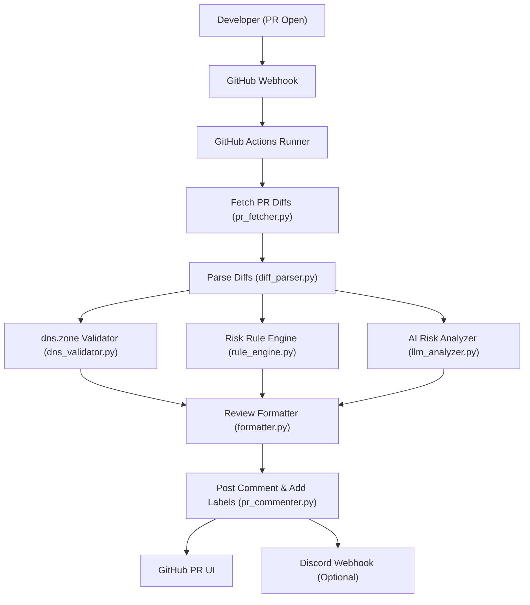

# 🏗️ Architecture Design Document — DNS Zone File Reviewer

This document details the system design, components, integration pathways, and data flows of the **IM-08 DNS Zone File Reviewer (GitHub PR Bot)**.

---

## 1. System Topology & Process Flow

The agent runs as an event-driven CI/CD task inside GitHub Actions. When a developer pushes DNS change files to a pull request, the workflow triggers, fetches the diffs, executes syntax and rule validation, queries a local Ollama instance running the Mistral 7B model, and comments on the PR.



---

## 2. Core Components

### 📥 1. PR Fetcher (`pr_fetcher.py`)
*   **Purpose:** Connects to the GitHub API via `PyGithub`.
*   **Mechanism:** Using the PR number and GitHub repository context, it checks all files listed in the PR, filters for files under the `zones/` directory, and downloads the original (`before`) and updated (`after`) contents along with the raw unified git diff patch.

### ✂️ 2. Diff Parser (`diff_parser.py`)
*   **Purpose:** Parses raw git patches into structured DNS records.
*   **Mechanism:** Inspects each line of the git patch:
    *   Lines starting with `+` are classified as `added`.
    *   Lines starting with `-` are classified as `removed`.
    *   It extracts individual DNS record parts (Domain/Subdomain Name, TTL, Class, Type, Value) using positional string tokenization. Comments (starting with `;`) and header metadata are ignored.

### 🔍 3. DNS Validator (`dns_validator.py`)
*   **Purpose:** Ensures syntax compliance of the modified zone file.
*   **Mechanism:** Passes the `after` zone content to the `dnspython` parser:
    *   Extracts the domain origin dynamically from the zone filename (e.g. `zones/example.com.txt` resolves to `example.com.`).
    *   Performs basic BIND layout compliance validation.
    *   Checks for the presence of the mandatory **SOA** (Start of Authority) and **NS** (Name Server) records at the zone root, reporting issues if missing.

### 📏 4. Rule Engine (`rule_engine.py`)
*   **Purpose:** Runs fast, deterministic checks for known risky operations.
*   **Mechanism:** Reads thresholds from `rules/dns_rules.yaml` and inspects the list of parsed changes. It flags:
    *   **Wildcards (`*`)** as a `critical` threat.
    *   **Low TTL values** (less than the `min_ttl` limit) as a `warning`.
    *   **High-risk records (MX, NS, SOA)** modifications as `high` or `critical` changes because they redirect mail traffic, authority delegation, or zone serials.

### 🧠 5. LLM Risk Analyzer (`llm_analyzer.py`)
*   **Purpose:** Provides contextual, human-readable risk analysis and actionable alternatives using local AI.
*   **Mechanism:** Queries a locally hosted **Ollama** server running **Mistral 7B** via its REST API (`/api/generate`). It enforces strict JSON schemas on the output. If the local LLM is unresponsive or unavailable, it gracefully fails back to a warning recommending manual inspection.

### 📝 6. Formatter (`formatter.py`) & Commenter (`pr_commenter.py`)
*   **Purpose:** Converts findings into developer-facing reviews.
*   **Mechanism:** Formats a markdown comment with severity indicators, posts it directly onto the GitHub Pull Request thread, attaches appropriate tags (e.g. `dns-reviewed`, `risk:critical`), and sends an optional alert to Discord.

---

## 3. AI Prompt Engineering

The LLM is configured with specialized instructions to act as a DNS security auditor. Below is the prompt template used:

### System Prompt
```text
You are a DNS security expert reviewing DNS zone file changes.
Analyze each DNS record change and classify its risk level.
Always respond in valid JSON only. No explanation outside JSON.
```

### User Input Prompt
```text
Analyze this DNS record change:

Change type: {change_type}
Raw record: {raw_record}
Record name: {record_name}
Record type: {record_type}
TTL: {ttl}
Value: {value}

Respond ONLY with this JSON structure:
{
  "risk_level": "safe|warning|high_risk|critical",
  "explanation": "2 sentence explanation of why this risk level",
  "suggestion": "one actionable suggestion or null if safe"
}
```

---

## 4. Operational Safety & Fallbacks

*   **Syntax Parse Failure:** If `dnspython` fails to parse a zone file (due to critical syntax errors), the script catches the exception, logs it as a syntax error block in the PR comment, and labels the PR as `risk:critical` to block automatic deployments.
*   **LLM Timeout/Failure:** If Ollama fails, a try-except block returns a safe `warning` stating: *"LLM analysis unavailable. Manual review recommended."* This prevents CI/CD builds from crashing during local model outages.
